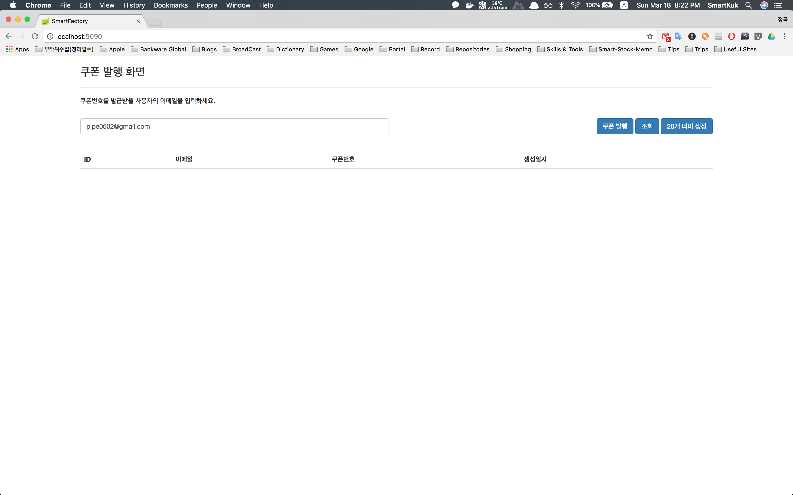

### smartkuk-coupon 개발과정 ###

처음 과제를 받고 개발했던 개바 로직들에 설명

[개발로직 1]

1. 쿠폰번호 랜덤하게 채번
2. DB 검사(이메일 중복검사, 번호 중복검사)
3. DB 저장

문제점: 쿠폰번호를 생성하는 로직의 성능은 특이사항은 없으나, 100개의 병렬 처리시 중복의 문제


[개발로직 2]

0. 쿠폰 pool 생성(1초 단위 스케줄러를 통해 사용 가능한 쿠폰을 pool에 계속 생성)
1. DB 검사(이메일 중복검사)
2. pool 테이블에서 번호 select lock을 사용한 쿠폰번호 획득
3. 획득한 생성된 쿠폰번호 상태변경
4. DB 저장

문제점: 쿠폰을 미리 준비해야 하는 스케줄러는 계속 pool을 감시, 쿠폰을 생성하기 위해서 2개의 테이블을 update, insert하는 로직이 늘어남


[확정로직]

1. DB 검사(이메일 중복검사)
2. 쿠폰번호 랜덤하게 생성
3. DB 저장(실패시 재시도 10회 1초 간격 반복)

### Build ###
maven 프로젝트로 구성이 되어있고, 빌드는 maven 빌드를 한다.

```bash
$ ./mvnw package #프로젝트 root 디렉토리로 이동하여 실행
```

### Run ###
빌드를 끝마치면 ${project_path}/target/smartkuk-coupon-0.0.1-SNAPSHOT.jar 파일이 생성되어 있는지 확인

아래와 같이 디렉토리를 이동후 jar 파일 실행 커맨드를 통하여 서버를 구동한다. `-DPORT=1234` 옵션을 통해서 포트를 변경 가능하며 입력하지 않으면 기본포트는 9090 이다.

```bash
$ cd ${project_path}
$ java -jar -DPORT=1234 ./smartkuk-coupon-0.0.1-SNAPSHOT.jar
```

### H2 콘솔 ###
Database는 H2 사용하고 서버 구동을 성공적으로 했다면 `http://localhost:1234/h2-console` 사용하여 접속할 수 있고 접속 정보는 아래와 같다.

```bash
JDBC URL: jdbc:h2:mem:smartkuk
User Name: sa
Password: 입력하지 않음
```

### Operating ###
로컬 환경에서 jar 파일을 실행후 브라우저에서 http://localhost:포트 입력하여 화면을 이용할 수 있음.

</img>
